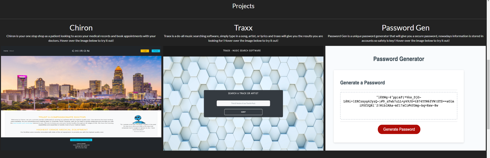
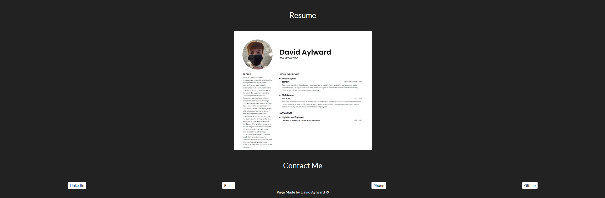

# Updated Portfolio

https://davidayl.github.io/updated-portfolio/

## Table Of Contents

* [About](#about)

* [Usage](#usage)

* [Reference Links](#reference)

* [Visuals](#visuals)

## About

This Project is to show my portfolio to potential employers. This page includes projects I've created, ways to contact me, and a brief summary of myself.

## Usage

This page is mainly going to be used by employers, but also by me to show potential clients if I want to freelance. This page serves as a one stop shop to knowing about me and my webdevelopment journey.

## Reference Links

### Bootstrap Theme

https://bootswatch.com/

### Bootstrap

https://getbootstrap.com/docs/5.1/getting-started/download/

### My github

https://github.com/DavidAyl

## Visuals

  

